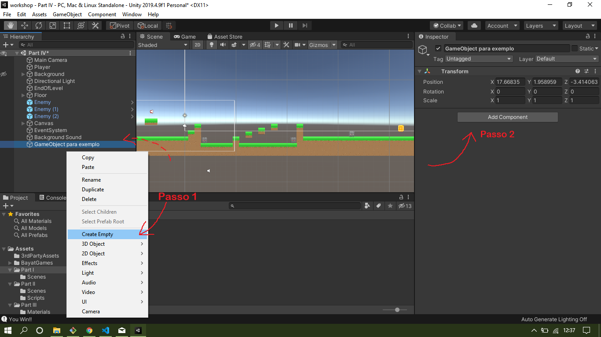
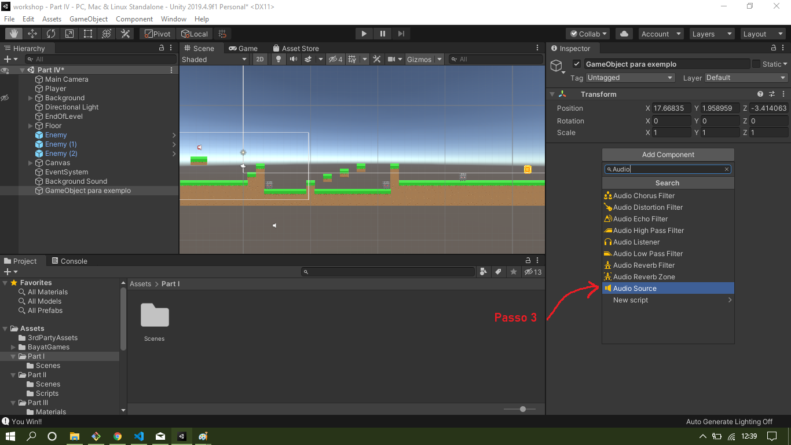
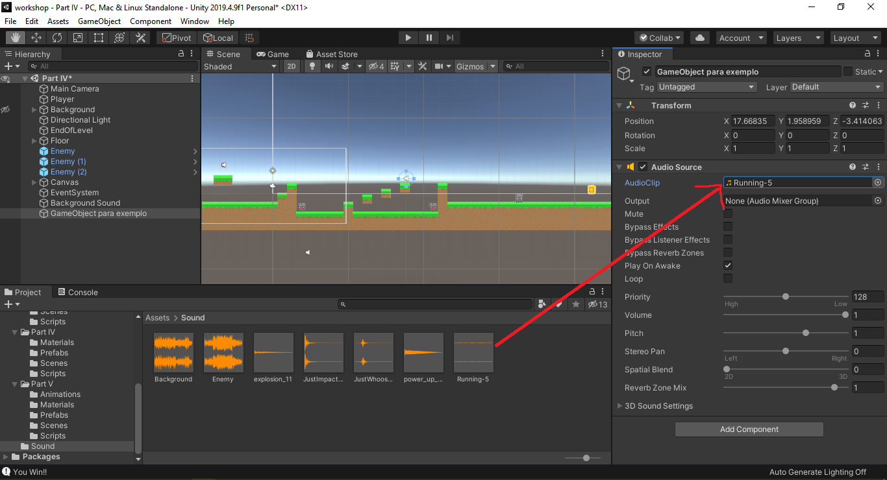

# Adicionar músicas e sons no Unity

## Como funciona os sons

Os sons do Unity são captados pela camera principal que possui um Audio Listener configurado automaticamente. Os sons do jogo são adicionados aos Game Objects com o Audio Source.

## Adicionar o Audio Source no Game Object

Para adicionar o Audio Source é necessário selecionar o Game Object que irá emitir o som, e na página de `Inspector` clicar em `Add Component` e selecionar o `Audio Source`.





## Assets de música

Para adicionar sons a um Game Obeject através do component 'Audio Source' é preciso tê-los como arquivo no diretório de seu projeto. Já existem milhares de opções gratuitas para que você possa fazer o download e em seguida importá-las e utilizar em seu jogo. O próprio Unity conta com a loja [Assets Store](https://assetstore.unity.com/)

## Adicionar o som ao Audio Source

Com os arquivos de músicas e sons já adicionados ao projeto é possivel adicionar as faixas ao Audio Source pelo Audio Clip. Pela interface do Unity, no componente Audio Source tem um campo Audio Clip, onde é possível selecionar arquivos de sons nas extensões `.aif`, `.wav`, `.mp3`, e `.ogg`.




## Manipular Sons por Script

### Audio Source
Para fazer a manipulação dos sons por script, é necessário, primeiramente referenciar uma variável para o Audio Source que será utilizado.

Adicione a referência ao audio dentro da classe do script:

``` cs
public AudioSource source;
```

O Audio Source pode ser linkado manualmente pela interface do Unity, ou se o Script foi adicionado no GameObject que possui o Audio Source, pode ser feito o link com o seguinte código que deve ser adicionado na função Start ou Awake do script:

```cs
source = GetComponent<AudioSource>();
```

**OBS.:** Lembrando que essa linha só deve ser adicionada se o Audio Source estiver no mesmo GameObject que o Script.

#### Funções básicas do Audio Source

O Audio Source possui algumas funções para manipular o som, como:
- Play
- Pause
- UnPause
- Stop

#### Play on Awake

Quando adicionado um Audio Source pela interface do Unity, ele começa com algumas propriedades selecionadas, como o `Play On Awake`, que faz com que o áudio comece a tocar assim que o objeto é instanciado, para fazer a manipulação de quando o som começa a tocar por script, é necessário desativar essa propriedade pela interface do Unity. Para desativá-lo, basta ir até o componente Audio Source e desmarcar a caixa do `Play On Awake`.

#### Loop

O loop é uma propriedade do Audio Source que faz com que o som toque repetidamente. Ele pode ser atribuido pela interface, ao selecionar a caixa `Loop` no componente Audio Source, ou pode ser também atribuido dinamicamente por scripts.

``` cs
source.loop = true;
```

### Audio Clip
É possivel mudar a música ou som que um Audio Source toca dinamicamente por script, para isso, é necessário atribuir variáveis públicas da classe Audio Clip para cada faixa.

``` cs
public AudioClip sound1, sound2, sound3;
``` 
Essas variaveis devem ser linkadas aos arquivos de sons pela interface do Unity. 

Para fazer a mudança de faixa, é necessário parar a música que tocava anteriormente, caso ainda estiver tocando e atribuir a variavel `clip` do Audio Source a nova faixa de música, faça as configurações necessárias, como atualizar a variável de loop para a nova faixa e coloque a nova música para tocar.

``` cs
source.Stop();
source.clip = sound2;
source.loop = false;
source.Play();
```


## Referências

https://www.studytonight.com/game-development-in-2D/audio-in-unity

https://docs.unity3d.com/Manual/class-AudioClip.html

